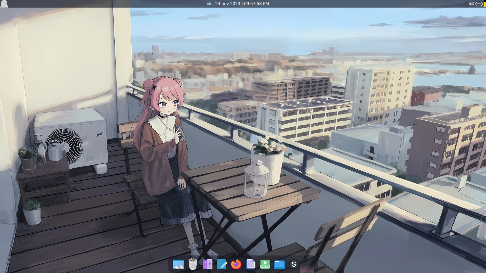

# LocOS-Atmospheric-Theme
Tema minimalista para Loc-OS.

## Instalación
Para instalar el tema ejecute los siguientes comandos en su terminal.
```bash
cd ~
git clone https://github.com/Suazo-kun/LocOS-Atmospheric-Theme
cd LocOS-Atmospheric-Theme
./install.sh
```

Cuando se ejecute el comando **./install.sh** se pedirán permisos para la instalación del tema, por lo que, deberá introducir su contraseña.

Previa la instalación, puede eliminar los archivos que ya no son útiles con los siguientes comandos.
```bash
cd ~
rm -rf LocOS-Atmospheric-Theme
```

## Desinstalación
Para desinstalar el tema ejecute el siguiente comando en su terminal.
```bash
sudo rm -rf /opt/Atmospheric-Theme
```

## Previsualización del tema

